 
  <h1>Lars Patzenbein</h1>
  <h3>Junior Fullstack Dev</h3>
  
  

    Junior Fullstack Developer | C# & Web Technologies  | Ex-Mediengestalter (UI/UX Fokus)

    
 Open Source Enthusiast | Focus on sustainable Software 
    
 

  
  
    
  
  
   

---

### Über mich
Durch meinen Hintergrund als Mediengestalter für Digital- und Printmedien (2011–2013) und meine aktuelle Umschulung zum Fachinformatiker für Anwendungsentwicklung (2025–2027) entwickle ich Anwendungen, die nicht nur sicher funktionieren, sondern auch intuitiv bedienbar sind.
Ich verbinde technische Logik mit visueller Ästhetik. 

Mein Privates Forschungsprojekt Nova-Quantum-Core beschäftigt sich u.a mit Post-Quantum-Verschlüsselung auf Edge-Devices und dient mir, mich in PQC-Algorithmen einzuarbeiten. 

### Aktueller Fokus:

​- Fullstack-Entwicklung: C#, .NET, Web-Technologies & Python.

​- UI/UX Design: Verständnis für Layout, Typografie und User Journey.

​- Sicherheit: Fokus auf sichere Software-Architekturen und Network Defense (Cisco Certified).

### Mein Antrieb:
Neben der Umschulung arbeite ich an einer Forum Web-App für die Dresdner Veranstaltungs Szene. 
Mein privates Forschungsprojekt Nova-Quantum-Core. 

Beschäftigt sich u.a. mit Post-Quantum-Verschlüsselung auf Edge-Devices und dient mir dazu, mich tiefgehend in komplexe Algorithmen und Sicherheitsstrukturen 
einzuarbeiten.

​Ich suche nach Herausforderungen, bei denen ich sauberen Code, IT-Sicherheit und durchdachtes Design vereinen kann."

### Tech Stack

  
  
   
  

### CreativeTools

### Zertifikate & Qualifikationen

**Cybersecurity (Cisco Networking Academy)**
 
    

**Software Development & AI (Microsoft / IBM / Cisco)**
 
   

 
### Learning Roadmap (Ziele bis 2027)
* **Cybersecurity:** Ethical Hacker, Endpoint Security, Network Technician (Cisco)
* **Cryptography:** IBM Encryption & Quantum Safe Learning
* **Google/Microsoft:** Developer Program Certifications

### GitHub Statistiken

  

