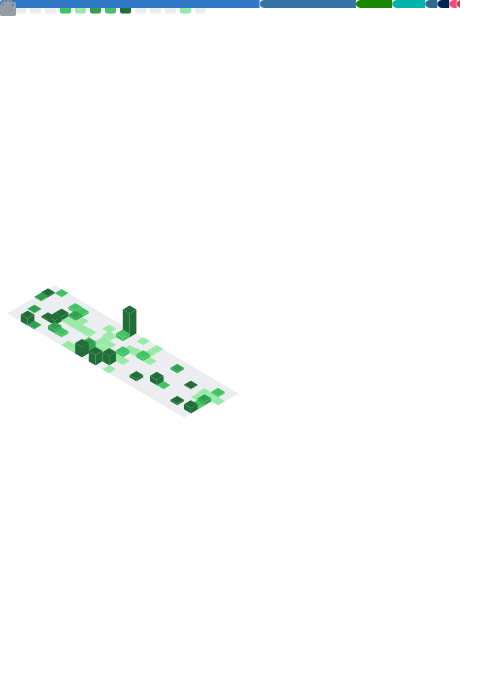

 

  

  <h1>Lars Patzenbein</h1>
  <h3>Junior Fullstack Dev</h3>
  
C#, Python & Web Technologie  | Ex-Mediengestalter (UI/UX Fokus) | Fokus auf nachhaltige Software

  

  

  

  

   

---

## Über mich

Ich schreibe Code nicht als Selbstzweck, sondern baue ganzheitliche digitale Produkte. Durch meine Erfahrung als Mediengestalter für Digital- und Printmedien (2011–2013) und meine aktuelle Entwicklung zum Fachinformatiker für Anwendungsentwicklung (FIAE) verbinde ich robuste Backend-Logik nahtlos mit intuitiven Frontends. Mein Fokus: Software, die technisch sicher funktioniert und visuell sofort überzeugt.

### 🎯 Aktueller Fokus:
* **Fullstack-Entwicklung:** C#, .NET, Python & moderne Web-Technologien.
* **UI/UX Design:** Ein tiefes Verständnis für Layout, Typografie und die optimale User Journey.
* **Architektur & Sicherheit:** Fokus auf saubere Software-Architekturen, Containerisierung (Docker) und Network Defense.

### 🚀 Mein Antrieb:
Neben meiner Umschulung entwickle ich eigenständig Software-Projekte, die nicht nur als Proof of Concept dienen, sondern reale Probleme lösen. Ich suche nach echten Herausforderungen, bei denen ich sauberen Code, IT-Sicherheit und durchdachtes Design zu performanten Produkten vereinen kann.

### Tech Stack

  
  
   
  

### CreativeTools

### Zertifikate & Qualifikationen

**Cybersecurity (Cisco Networking Academy)**
 
    

**Software Development & AI (Microsoft / IBM / Cisco)**
 
   

 
### Learning Roadmap (Ziele bis 2027)
* **Cybersecurity:** Ethical Hacker, Endpoint Security, Network Technician (Cisco)
* **Cryptography:** IBM Encryption & Quantum Safe Learning
* **Google/Microsoft365:** Developer Program Certifications

### GitHub Statistiken

  

